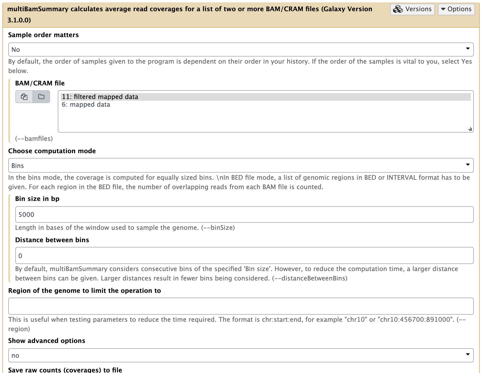
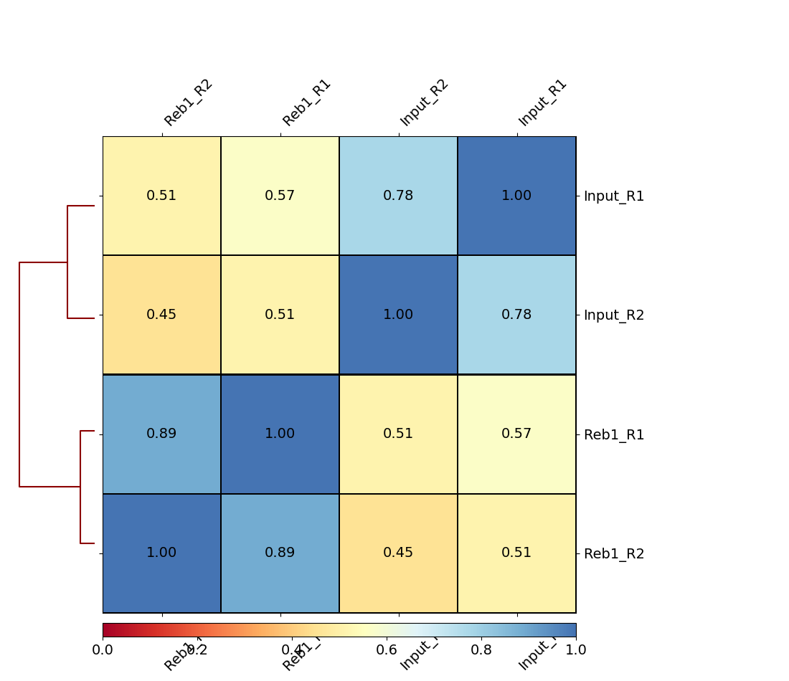
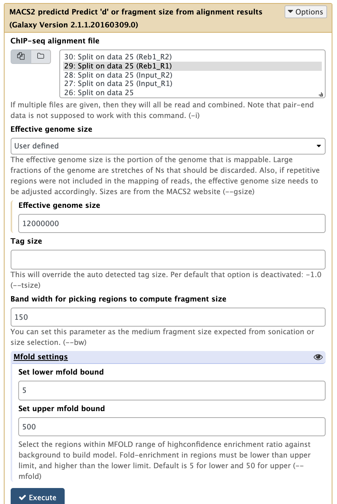
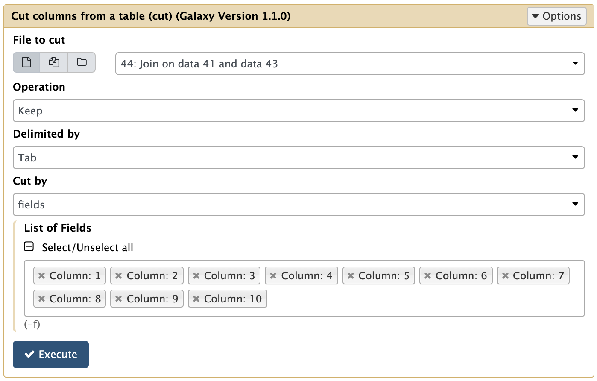

# Analysis of ChIP-seq data

- [Overview](#overview)
- [Data](#data)
  * [Reb1 ChIP-exo](#reb1-chip-exo)
  * [Data description](#data-description)
  * [Data location](#data-location)
  * [Uploading](#uploading)
- [Mapping and Post-processing](#mapping-and-post-processing)
  * [Mapping](#mapping)
  * [Post-processing](#post-processing)
- [Assessment of ChIP quality](#assessment-of-chip-quality)
  * [Correlation among samples](#correlation-among-samples)
  * [Assessing signal strength](#assessing-signal-strength)
- [Generating bigWig datasets for display](#generating-bigwig-datasets-for-display)
  * [Generating bigWig datasets](#generating-bigwig-datasets)
  * [Displaying coverage tracks in a browser](#displaying-coverage-tracks-in-a-browser)
- [Calling peaks](#calling-peaks)
  * [How does MACS work?](#how-does-macs-work-)
  * [Finding peaks](#finding-peaks)
    + [Splitting data into individual samples](#splitting-data-into-individual-samples)
    + [Running MACS2](#running-macs2)
- [Inspecting peaks](#inspecting-peaks)
  * [What is in the output?](#what-is-in-the-output-)
  * [How many peaks are common between replicates?](#how-many-peaks-are-common-between-replicates-)
  * [Let's look at everything in the browser](#let-s-look-at-everything-in-the-browser)
  * [What sequence motifs are found within peaks](#what-sequence-motifs-are-found-within-peaks)
  * [Summarizing ChIP signal enrichment across all genes](#summarizing-chip-signal-enrichment-across-all-genes)
- [Galaxy history](#galaxy-history)

## Overview

<small>
This tutorial is slightly modified from the Galaxy ChIP-seq tutorial written by Anton Nekrutenko (https://galaxyproject.org/tutorials/chip/). That tutorial was inspired by efforts of [Mo Heydarian](https://galaxyproject.org/people/mo-heydarian/) and [Mallory Freeberg](https://github.com/malloryfreeberg). Tools highlighted here have been wrapped by [Björn Grüning](https://github.com/bgruening), [Marius van den Beek](https://github.com/mvdbeek) and other [IUC](https://galaxyproject.org/iuc/) members. [Dave Bouvier](https://github.com/davebx) and [Martin Cech](https://github.com/martenson) helped fine tuning and deploying tools to Galaxy's public server.
</small>

In this tutorial we will:

- pre-process sequencing reads
- map reads
- post-process mapped data
- assess quality and strength of ChIP-signal
- display coverage plots in a genome browser
- call ChIP peaks with `MACS2`
- inspect obtained calls
- look for sequence motifs within called peaks
- look at distribution of enriched regions across genes.

## Data

Datasets for this tutorial were generated in the lab of [Frank Pugh](http://bmb.psu.edu/directory/bfp2).

### Reb1 ChIP-exo

For this analysis, we will be using [ChIP-exo](http://www.sciencedirect.com/science/article/pii/S0092867411013511) datasets. For this experiment, immunoprecipitation was performed with antibodies against Reb1. Reb1 recognizes a specific sequence (`TTACCCG`), is involved in many aspects of transcriptional regulation by all three yeast RNA polymerases, and promotes formation of nucleosome-free regions (NFRs) ([Hartley & Madhani:2009](https://www.ncbi.nlm.nih.gov/pmc/articles/PMC2677553/);  [Raisner:2005](https://www.ncbi.nlm.nih.gov/pmc/articles/PMC2039754/)).

<div class="alert alert-info" role="alert">
Although this is ChIP-exo data, in this tutorial we will mostly analyze it as if it were standard ChIP-seq. We will explain peculiarities of ChIP-exo analysis in a dedicated tutorial.
</div>

### Data description

There are four datasets:

| Dataset            | Description                |
|--------------------|----------------------------|
| Reb1_R1            | ChIP experiment, Replicate 1 |
| Input_R1           | Input DNA, Replicate 1 |
| Reb1_R2            | ChIP experiment, Replicate 2 |
| Input_R2           | Input DNA, Replicate 2 |

### Data location
In Galaxy, go to "Upload Data", --> "Paste/Fetch Data", and then paste the following four URLs:

http://e1-lugh2.science.psu.edu/data/xo/Reb1_rep1.fastq

http://e1-lugh2.science.psu.edu/data/xo/Reb1_rep2.fastq

http://e1-lugh2.science.psu.edu/data/xo/Input_rep1.fastq

http://e1-lugh2.science.psu.edu/data/xo/Input_rep2.fastq


Then press "Start" and "Close". The files should begin uploading to your Galaxy history. 


### Uploading

After uploading datasets into your Galaxy history, we will combine all datasets into a single dataset collection. This will simplify downstream processing of the data. The process for creating a collection for this tutorial is <a href="https://player.vimeo.com/video/212757252">is shown here</a>.

## Mapping and Post-processing

### Mapping

In this particular case, the data is of very high quality and do not need to be trimmed or postprocessed in any way before mapping. We will proceed by mapping all the data against the yeast genome **`sacCer3`** with BWA:

<div class="alert alert-warning" role="alert"></div>

|      |
|------|
||
|<small>**Mapping all data at once**. Note that **Select input type** is set to `Single fastq` and by selecting folder (<i class="far fa-folder" aria-hidden="true"></i>) button you can select as entire collection of fastq datasets. **Important**: here we also set readgroups automatically by toggling **Set readgroups information** dropdown to `Set readgroups (SAM/BAM specification)` and setting all **Auto-assign** button to `Yes`. </small>

<div class="alert alert-warning" role="alert"><i class="fa fa-exclamation-circle" aria-hidden="true"></i> Running `BWA` on a collection will generate another collection of BAM files. Name this collection `mapped data` (for help on how to rename a collection <a href="#" data-toggle="modal" data-target="#collection_rename_video">see this video)</a>.</div>

### Post-processing

For post-processing we will remove all non-uniquely mapped reads. This can be done by simply filtering out all reads with [mapping quality](http://genome.sph.umich.edu/wiki/Mapping_Quality_Scores) less than `20` using **NGS: SAMtools &rarr; Filter SAM or BAM**:

|      |
|------|
||
|<small>**Filtering multi-mapped reads** by restricting the data to reads with mapping quality above 20. Note that by selecting the folder (<i class="far fa-folder" aria-hidden="true"></i>) button, you can select an entire collection of BAM datasets to filter at once.</small>

<div class="alert alert-warning" role="alert"><i class="fa fa-exclamation-circle" aria-hidden="true"></i> Running `Filter SAM or BAM` on a collection will generate another collection of BAM files. Name this collection `filtered data` (for help on how to rename a collection <a href="https://player.vimeo.com/video/212758694">see this video)</a>.</div>

## Assessment of ChIP quality

After we map and filter the reads, it is time to make some inferences about how good the underlying data is.

### Correlation among samples

In our experiment there are two replicates, each containing treatment and input (control) datasets. The first thing we can check is whether the samples are correlated (in other words if treatment and control samples across the two replicates contain this same kind of signal). To do this, we first generate a read count matrix using **NGS: DeepTools &rarr; multiBamSummary**.

|      |
|------|
||
|<small>**Running multiBAMsummary** on a collection of BAM datasets (as before you can select a collection by pressing the folder (<i class="far fa-folder" aria-hidden="true"></i>) button).</small>

This tool breaks the genome into bins of fixed size (5,000 bp in our example) and computes the number of reads falling within each bin. You should use larger bins (e.g. 10,000bp) with a larger genome, but the yeast genome is only 12Mbp and regulatory signals are more compact. Here is a fragment of its output:

```
#'chr' 'start' 'end'  'Reb1_R1'  'Input_R1'  'Input_R1'  'Reb1_R2'
chrVI      0    1000   19.0         41.0         3.0        6.0
chrVI   1000    2000   29.0         30.0        13.0        5.0
chrVI   2000    3000    0.0          0.0         0.0        0.0
chrVI   3000    4000    0.0          2.0         0.0        0.0
chrVI   4000    5000 7447.0        139.0         7.0     2645.0
```

we can then feed this matrix into **NGS: DeepTools &rarr; plotCorrelation** to generate heat map like this:

|      |
|------|
||
|<small>**A.** Running `plotCorrelation` on output of `multiBamSummary`.</small>|
||
|<small>**B.** Heatmap of four samples: Treatments (Reb1) and controls (Input) display relatively higher correlation among themselves.</small>|

Here we can see that there are better correlations between replicates (between Reb1_R1 and Reb1_R2, and between input_R1 and input_R2), while correlations between treatments (Reb1) and controls (input) are weak. This is a good sign implying that there is some signal on our data.

### Assessing signal strength

How do we tell if we have signal coming from ChIP enrichment? One way of doing this is the Signal Extraction Scaling (SES) approach proposed by [Diaz:2012](https://www.degruyter.com/downloadpdf/j/sagmb.2012.11.issue-3/1544-6115.1750/1544-6115.1750.pdf). SES works as follows. Suppose we have two datasets: ChIP and Input DNA. We divide the genome into *N* non-overlapping windows (*N* = 10 in the example below) and for each window compute the number of reads. This way we end up with two lists: one listing read counts for ChIP (ChIP list) and the other for Input (Input list):

```
Window   ChIP-count Input-count
-------------------------------
 1         3          3
 2         4          3
 3         2          1
 4         1          3
 5         3          3
 6        27          2
 7        18          3
 8         2          2
 9        45          3
10         8          3
```

 We then sort the ChIP list in ascending order and move elements in the Input list to match this order:

```
 Window   ChIP-count Input-count
-------------------------------
4           1         3
3           2         1
8           2         2
1           3         3
5           3         3
2           4         3
10          8         3
7          18         3
6          27         2
9          45         3
```

Now let's add another two columns to this dataset. These columns will show the cumulative percentages of reads up to each row for the ChIP and Input data. For example, 0.044 on row 3 is (1 + 2 + 2)/113 = 0.044.

```
 1   2   3  4      5
-------------------------------
 4   1   3  0.008  0.115
 3   2   1  0.026  0.153
 8   2   2  0.044  0.230
 1   3   3  0.070  0.346
 5   3   3  0.097  0.230
 2   4   3  0.132  0.576
10   8   3  0.203  0.692
 7  18   3  0.362  0.807
 6  27   2  0.601  0.884
 9  45   3  1.000  1.000
------------------------
   113  26    

Where:

1 = Window, 2 = read count in ChIP, 3 = read count in Input
4 = % or read to this point in ChIP 5 = % of read to this point
```

In the matrix above a large portion of ChIP reads (column 4) is concentrated in the few bins close to the bottom. This is not the case for the input reads (column 5). If we plot two last columns of this matrix we will get a curve like this:

|      |
|------|
||
|<small>**SES** plot for our toy example. Most "reads" in the ChIP experiment are concentrated in the last three bins.</small>|

[DeepTools](https://deeptools.github.io/) provide a nice explanation of how the success of a ChIP experiment can be judged based on SES (also called *fingerprint*) plots:

|      |
|------|
||
|<small>**DeepTools** explanation of SES plots.</small>|

So let's apply this to our own data using **NGS: DeepTools &rarr; plotFingerprint**:

|      |
|------|
||
|<small>**A.** Running `plotFingerprint` on filtered data (15.).</small>|
||
|<small>**B.** SES fingerprint of four samples: Treatments (Reb1) show a characteristic shape indicating ChIP signal. Approximately 30% of reads are contained in a small percentage of the genome.</small>|

## Generating bigWig datasets for display

In this section we will convert BAM files generated with `bwa` into [bigWig](https://genome.ucsc.edu/goldenpath/help/bigWig.html) format that will allow us to view read coverage distribution across the genome. We will also "pre-warm" a genome browser for displaying peaks we will be calling in the next section.

### Generating bigWig datasets

We will use **NGS: DeepTools &rarr; bamCoverage**:

|      |
|------|
||
|<small>**Running bamCoverage** on a collection of filtered BAM datasets (as before you can select collection by pressing folder (<i class="far fa-folder" aria-hidden="true"></i>) button). Here we set **Bin size** to `1` so that we can see the high-resolution nature of the ChIP-exo data.  Next we set **Effective genome size** to `user specified` and enter `12000000` (approximate size of *Saccharomyces cerevisiae* genome).  </small>|

Note that the default behavior of bamCoverage will not perform any pseudo-extensions to the read lengths. In ChIP-seq data, we often apply a pseudo-extension up to the expected ChIP fragment size length, which has the effect of smoothing the data plots. This is not typically appropriate for ChIP-exo data, as the smoothing removes the high-resolution nature of the experimental data. In fact, we often only examine the 5' coordinate of mapped ChIP-exo reads. However, the default behavior of the bamCoverage tool (i.e. counting the full read length in terms of coverage) is fine for this example.

<div class="alert alert-warning" role="alert"><i class="fa fa-exclamation-circle" aria-hidden="true"></i> Running `bamCoverage` on a collection of BAM datasets will generate a collection of bigWig datasets. Name this collection `coverage` (for help on how to rename a collection <a href="#" data-toggle="modal" data-target="#collection_rename_video">see this video</a>).</div>

### Displaying coverage tracks in a browser

Now we can display bigWig datasets generated in the previous section in a genome browser. There are a variety of available browsers. In this tutorial we will use the UCSC Browser.

|      |
|------|
||
|<small>**Collection of bigWigs** produced by `bamCoverage` above. Note that in the one expanded dataset (`Reb1_R2`) there is a `display at UCSC main` link.</small>|

Clicking this link in all four datasets (you will need to expand each dataset by clicking on it. This will expose the UCSC links) and focusing the browser on the *RPA14* gene will produce the following image:

|      |
|------|
||
|<small>**Coverage** display of one Reb1 replicate at the *RPA14* gene. </small>

## Calling peaks

While the peaks shown in the browser screenshot above are pretty clear and consistent across the two replicates, looking at the entire genome in the browser is hardly a sustainable way to identify all peaks. There are several ways for identifying binding events genome-wide. They are summarized in the figure below:

|                |
|----------------|
||
|<small>**Outline of three ChIP-seq binding event detection methods**. Peak-finding methods typically either shift the ChIP-seq tag locations in a 3′ direction by half the expected fragment length, or extend the length of the tag in a 3′ direction to be equal to the expected fragment length. Tags from opposite strands are merged to construct an unstranded tag density landscapes, and binding event locations are predicted from the locations with maximum tag coverage within each region that contains a significant enrichment of ChIP-seq tags (i.e. the peak summit). Peak-pairing methods [e.g. GeneTrack] build similar tag density landscapes, but retain strandedness information and typically do not shift or extend the tag locations. Peak locations are determined on each strand separately, and nearby peaks in the correct stranded orientation within a given distance are paired together. Binding event locations are predicted from the peak-pair midpoint locations. Probabilistic binding detection methods aim to estimate the locations of binding events that could have given rise to the observed ChIP-seq tag locations. These methods begin training with initial guesses of binding event locations and a model of how tags are expected to be distributed around real ChIP-seq binding events. During each training step, every ChIP-seq tag is probabilistically associated with nearby binding events, depending on the distance between the tag and the event location. Given these probabilistic tag assignments, binding event locations are updated to achieve a better fit with their associated tags, and the model of how tags are distributed around binding events is updated to reflect the accumulation of tags around all current binding events. During the training process, binding events with few assigned tags are weeded out of the model, and the process eventually converges to a set of final binding locations. (Figure and legend from [Mahony and Pugh:2015](http://www.tandfonline.com/doi/full/10.3109/10409238.2015.1051505)).</small>

In this tutorials we will use the [MACS2](https://github.com/taoliu/MACS) peak caller.

### How does MACS work?

[MACS](https://www.ncbi.nlm.nih.gov/pubmed?cmd=search&term=18798982) (or its current version `MACS2`) performs several steps for calling peaks from paired treatment/control datasets:

|                |
|----------------|
||
|<small>**Steps of the MACS workflow** (From [Feng:2012](http://www.nature.com/nprot/journal/v7/n9/full/nprot.2012.101.html)).</small>|

Here is a concise description of these steps:

- **Removing redundancy** - MACS retains uniquely mapped reads and removes reads that are repeatedly mapped to the same location. This reduces effects of PCR amplification biases during library preparation.
- **Build model and estimate fragment size** - one of the MACS inputs is the fragment size or *bandwidth*, which is approximate size of DNA fragments generated during fragmentation step of library preparation. MACS first slides a window sized at twice the bandwidth across the genome and finds instances where read counts enriched by between 10 and 30 fold relative to the genome background. It then randomly samples 1,000 of such regions and builds the model. To build the model, it separates reads mapping to each of the strands and builds two distributions (two modes). The midpoint between the two modes is the middle of the binding size and the distance between the modes is the average fragment size `d` (see Figure below).

|                |
|----------------|
||
|<small>Peaks mapped to two strands are treated separately to build two coverage density profiles - the two modes. The distance between the modes is the fragment size `d`. This profile is build from 1,000 randomly selected enriched regions (From [Zhang:2008](https://www.ncbi.nlm.nih.gov/pubmed?cmd=search&term=18798982)).</small>|


- **Generate peaks** - now that *d* has been defined, MACS slides a window of size *2d* across the genome to identify regions significantly enriched in the ChIP sample. MACS assumes that background reads obey [Poisson distribution](https://en.wikipedia.org/wiki/Poisson_distribution). Thus, given the number of reads in a given interval within the control sample, we can calculate the probability of having the observed number of reads in the ChIP sample (e.g., see flood example [here](https://en.wikipedia.org/wiki/Poisson_distribution#Examples_of_probability_for_Poisson_distributions)). This procedure is performed for several intervals around the examined location (*2d*, 1kb, 5kb, 10kb, and the whole genome) and the maximum value is chosen. One problem with this approach is that it only works if both samples (ChIP and control) are sequenced to the same depth, which is not usually happening in practice. To correct this, MACS scales down the larger sample.

- **Compute False Discovery Rate (FDR)** - [Feng:2012](http://www.nature.com/nprot/journal/v7/n9/full/nprot.2012.101.html) explains computing FDR in MACS as follows: <em>"When a control sample is available </em>(and you should really always use it - AN)<em>, MACS can also estimate an empirical FDR for every peak by exchanging the ChIP-seq and control samples and identifying peaks in the control sample using the same set of parameters used for the ChIP-seq sample. Because the control sample should not exhibit read enrichment, any such peaks found by MACS can be regarded as false positives. For a particular P value threshold, the empirical FDR is then calculated as the number of control peaks passing the threshold divided by the number of ChIP-seq peaks passing the same threshold." </em>

### Finding peaks

In our case we have two replicates, each containing ChIP and input DNA samples. We will first run `MACS2` on pooled data (combining two ChIP samples and two inputs, respectively). We will then run `MACS2` on each replicate individually. Finally, we will pick a robust set of peaks present in all three callsets.

#### Splitting data into individual samples

One complication with the way we processed all data is that we have combined everything in a single dataset collection. MACS however will need for us to separate ChIP samples and controls. Fortunately for us [we have set readgroups](/tutorials/chip/#mapping) when we were mapping reads to the yeast genome. This will come handy for us right now because we will:

- merge the entire collection of mapped and filtered BAMs into a singe BAM dataset
- split this dataset into four separate BAM files using readgroups
- run MACS on resulting files.

<div class="alert alert-danger" role="alert">This slight complication is a result of current implementation of collection in Galaxy. As we are advancing collection implementation, this tutorial will be modified to make this steps more elegant in the future.</div>

First, to merge a collection of mapped, filtered BAM files into a single dataset we will use **NGS: Picard &rarr; MergeSamFiles**:

|                |
|----------------|
||
|<small>**Merging a collection** with `MergeSamFiles`. Here we use default parameters.</small>|

Next, we will use **NGS: SAMtools &rarr; Split** to separate merged file into individual BAM files. Each resulting BAM file will contained aligned reads corresponding to original four datasets:

|                |
|----------------|
||
|<small>**Splitting BAM dataset** on readgroups. This will produce four BAM datasets.</small>|
||
|<small>**Resulting datasets**. Each contains aligned reads from the four original conditions.</small>|

#### Running MACS2

Now it is time to run MACS2. First we will use the **NGS: Peak calling &rarr; MACS2 predictd** tool from the `MACS2` package. This tool will help us to find optimal parameters for running peak calling function of `MACS2`:

|                |
|----------------|
||
|<small>**Running `predictd`** for estimate the *d* parameter. Here we set **Effective genome size** to Yeast-specific value, set **Band width** to `150` (the fragment length after size selection), and increase **Set upper mfold bound** to `500` (this is a ChIP-exo experiment where we expect to have sharp, greatly enriched regions. Leaving this parameter at its default of `50` may fail to find any peaks because these particular datasets were generated by ChIP-exo protocol).</small>|

<div class="alert alert-warning" role="alert"><i class="fa fa-exclamation-circle" aria-hidden="true"></i> Do this on the other replicate as well!</div>

This procedure will help us estimate the *d* parameter by performing the [cross-correlation] analysis between reads mapping to + and - strands. Let's look at these results:

| Replicate 1                     | Replicate 2                     |
|:--------------------------------|---------------------------------|
|||
|<small>Peak model and lag between strands.</small>|                |

In the case of these data, peaks are very sharp and have narrow gap between them: `27` and `33` bp for replicate 1 and 2, respectively. We will use an average of these values, `30`, as `--extsize` parameter for calling peaks using **NGS: Peak calling &rarr; MACS2 callpeak**:

|                |
|----------------|
||
|<small>**Calling peaks with `MACS2` on pooled data**. Here we choose multiple inputs by pressing <i class="far fa-copy" aria-hidden="true"></i> button and selecting both ChIP datasets in **ChIP-Seq Treatment File** and both Input DNA datasets in **ChIP-Seq Control File**. We then select `Saccharomyces cerevisiae` genome as the **Effective genome size**. `MACS2`s interface is long and we split it into several pieces in this figure. See the lower section as well - it is important!</small>|
||
|<small>In this lower part of `MACS2` interface set **Build model** to `Do not build the shifting model` (we have already done this with `predictd` in the previous step) and **Set extension size* to `30` (the number we estimated in the previous step). Finally, we will only ask `MACS2` to produce two outputs: `Peak summits` and the one it produced by default, which contains peak coordinates.</small>|

If you set parameters as was shown above `MACS2` will produce two outputs (if it produced more just find the ones called `narrow peaks` and `summits`). Let's click on the pencil icon(<i class="fas fa-pencil-alt" aria-hidden="true"></i>) adjacent to `summits` and `narrow peak` datasets and rename then as shown below:

|         |
|---------|
||
|<small>**`MACS2` output** with `summits` and `narrow peak` datasets renamed.</small>|.

Next, we will run `MACS2` on BAM datasets for Replicate 1 only:

|                |
|----------------|
||
|<small>**Calling peaks with `MACS2` on R1** With the exception of selecting only R1 datasets, all other parameters should be set as in the previous figure.</small>|

<div class="alert alert-warning" role="alert"><i class="fa fa-exclamation-circle" aria-hidden="true"></i> Now do this by yourself:
<hr>
	<ul>
	    <li>rename resulting datasets as `R1 summits` and `R1 peaks`</li>
	    	       <li>run `MACS2` run on Replicate 2</li>
		       	       <li>rename resulting `summits` and `narrow peak` datasets as `R2 summits` and `R2 peaks`.</li>
			       </ul>
</div>

In the end, you should have something like this:

|                |
|----------------|
||
|<small>**All `MACS2` datasets**. After running `MACS2` three times we should have polled, R1, and R2 datasets.</small>

## Inspecting peaks

### What is in the output?

Looking at MACS2 data we have gotten the following numbers of peaks:

| Pooled | Replicate 1 | Replicate 2 |
|-------:|------------:|------------:|
|  967   |  947        |  784        |

Peaks data is generated in the following format:

```
   1      2      3            4   5 6        7        8        9  10
--------------------------------------------------------------------
chrI     35    491 MACS2_peak_1 176 . 10.35332 21.51081 17.68957 101
chrI  87135  87212 MACS2_peak_2 127 .  7.71763 15.89278 12.78060  26
chrI  92612  92793 MACS2_peak_3 153 .  9.22373 18.72748 15.31966  49
chrI 119739 119782 MACS2_peak_4  78 .  6.08885 10.52482  7.82302  25
```

where columns  are:

 1. Chromosome
 1. Start
 1. End
 1. Iterative id given by `MACS2`
 1. Integer score for display
 1. Strand (irrelevant in this case)
 1. Fold-change (fold enrichment for this peak summit against random Poisson distribution with local [lambda](https://en.wikipedia.org/wiki/Poisson_distribution))
 1. -log<sub>10</sub>*P*-value (e.g., 17.68 is 1 x 10<sup>-17</sup>)
 1. -log<sub>10</sub>*Q*-value from [Benjamini–Hochberg–Yekutieli procedure](https://en.wikipedia.org/wiki/False_discovery_rate#Benjamini.E2.80.93Hochberg.E2.80.93Yekutieli_procedure.)
 1. Relative summit position to peak start

### How many peaks are common between replicates?

To see how many peaks are common between the pooled datasets and the two replicates we will use **Operate on Genomic Intervals &rarr; Join** tool twice.

<div class="alert alert-danger" role="alert">Galaxy main has two tools called **Join**. Don't confuse them! Here we are using the one from **Operate on Genomic Intervals** section. </div>

First we will join `Peaks pooled` with `Peaks R1`:

|         |
|---------|
||
|<small>**Joining Pooled and R1** results with `Join` tool. Note that because we renamed the datasets they are now easily selectable.</small>|

Next we will join the result of the previous operation with `Peaks R2`:

|         |
|---------|
||
|<small>**Joining Pooled/R1 with R2** results with `Join` tool. Note that because we renamed the datasets they are now easily selectable.</small>|

This results in 722 regions are shared among polled, R1, and R2 peaks. Let's call these the **High confidence peaks**. Before we can use them, however, let's cut out only relevant columns. Since we have produced this dataset by joining three other datasets, it is three times wider (30 columns). To cut this first three columns we can use **Text Manipulation &rarr; Cut columns** tool:

|         |
|---------|
||
|<small>**Cutting columns** from `Join` output.</small>|

<div class="alert alert-warning">Rename the last dataset as `High confidence peaks`. This will make it easy to find as we continue.</div>

<div class="alert alert-danger" role="alert">Using `Cut columns` tool produces a dataset of tabular type. However, by cutting the first ten columns we have created a dataset in BED format. Thus we need to let Galaxy know about that by resetting metadata as shown below.</div>

Next, we need to make sure that the output of the `Cut columns` tool has the type `BED`. Also specify the genome build as `sacCer3`. To do this we will edit its metadata as show below:

|         |
|---------|
||
|<small>**Setting metadata** to datatype `BED`. Click the pencil icon(<i class="fas fa-pencil-alt" aria-hidden="true"></i>) adjacent to the dataset and choose **Datatype** tab. There you will be able to set it to `BED`.</small>|

### Let's look at everything in the browser

Let's visualize Merged peaks as well as Narrow peaks and Summits produced by `MACS2` in the UCSC genome browser by clicking on `display at UCSC` links adjacent to `Peaks pooled` and `High confidence peaks` datasets:

|         |
|---------|
||
|<small>**An overview in UCSC**. Here you can see original bigWig datasets along with predicted peaks.</small>

### What sequence motifs are found within peaks

In this experiment, antibodies against Reb1 protein have been used for immunoprecipitaion. The recognition site for Reb1 is `TTACCCG` ([Badis:2008](http://www.sciencedirect.com/science/article/pii/S1097276508008423) and [Harbison:2004](http://www.nature.com/nature/journal/v431/n7004/abs/nature02800.html)). To find out which sequence motifs are found within our peaks, we first need to convert coordinates into underlying sequences. This is done using the **BED tools &rarr; GetFastaBed** tool:

|         |
|---------|
||
|<small>**Extracting genomic DNA** corresponding to ChIP-seq peaks. Here we use `Merged peaks` dataset generated few steps earlier.</small>|

Next, we need to make sure that all sequences are sufficiently long for finding patterns. [MEME](http://meme-suite.org/), the tools we will use to find motifs, requires sequences to be at least 8 nucleotides long. Besides, very short peak sequences are unlikely to be exactly overlapping the bound motif, so we will enforce minimum sequence length of 20bp using **FASTA manipulation &rarr; Filter sequences by length** tool:

|         |
|---------|
||
|<small>**Filtering FASTA** by length. Here we are removing all sequences shorted than 20 nucleotides.</small>|

Now we can run **Motif Tools &rarr; MEME**:

|         |
|---------|
||
|<small>**Running MEME** on length-filtered FASTA sequences from the previous step. Note that **Options configuration** is set to `Advanced` and **Check reverse complement** is set to `Yes`.</small>|

`MEME` generates a number of outputs. The most interesting is the HTML Report. It shows that MEME discovers the expected `TTACCCG` motif at high frequency in the sequences:

|         |
|---------|
||
|<small>**MEME Motif** found from 619 sequences in the common peak regions.</small>|


MEME can take a while to run, even on a relatively small set of sequences like this. Alternatively, you could also try running **Motif Tools &rarr; MEME-ChIP**, which performs a more comprehensive range of motif analyses and is suitable for analyzing large collections of sequences:

|         |
|---------|
||
|<small>**Running MEME** on length-filtered FASTA sequences.</small>|

Unfortunately, the HTML file generated by MEME-ChIP is not viewable within Galaxy. However, you can download the results to your computer, unzip the file, and view the HTML file in a browser. Doing so should provide the following result:

|         |
|---------|
||
|<small>**MEME-ChIP Results** summarizing analysis of the common peak regions.</small>|

### Summarizing ChIP signal enrichment across all genes

How many genes contain upstream regions enriched in ChIP tags? This is often represented as a heatmap:

|         |
|---------|
||
|<small>**Heatmap example** from [DeepTools documentation](https://deeptools.readthedocs.io/en/latest/).</small>|

To generate the heatmap, we must first produce normalized datasets for the two replicates we have. This is done using **NGS: DeepTools &rarr; bamCompare** tool:

|         |
|---------|
||
|<small>**Running `bamCompare`** on replicate 1. Here we set **Method to use for scaling the largest sample to the smallest** to `SES` (although you may want to try other methods as well. SES was briefly discussed [above](/tutorials/chip/#assessing-signal-strength).</small>|

<div class="alert alert-warning">Perform the same analysis on Replicate 2 datasets and rename the two resulting items as `R1 normalized` and `R2 normalized`.</div>

Because we want to plot enrichment around genes we need to download gene annotation. We will use **Get Data &rarr; UCSC Main** for this:

|         |
|---------|
||
|<small>**Getting data from UCSC**. Here make sure you select **assembly** called `sacCer3` and you are choosing `SGD Genes`. Clicking **get output** will show the next screen shown below.</small>|
||
|<small>Here just click **Send query to Galaxy**.</small>|

Next, to prepare data necessary for drawing the heatmap we will use **NGS: DeepTools &rarr; computeMatrix** utility:

|         |
|---------|
||
|<small>**Computing matrix** - the data from which heatmap will be built. Here **both** normalized datasets are select within **Score file** box, yeast genes we have just downloaded from UCSC are chosen as **Regions to plot**. 'reference-point is set as **computeMatrix main option** and, finally, upstream and downstream distances are set to 2,000 bp. Obviously you are welcome to play with these parameters. </small>|

Finally, we can visualize the heatmap by using **NGS: DeepTools &rarr; plotHeatmap** tool:

|         |
|---------|
||
|<small>**Drawing heatmap** with `plotHeatmap` tool. </small>|

The resulting image shows that a significant fraction of the 6,692 genes present in the annotation data we have used contain Reb1 binding sites within their upstream regions:

|         |
|---------|
||
|<small>**Heatmap** showing distribution of Reb1 binding sites across upstream regions of 6,692 yeast genes.</small>|

